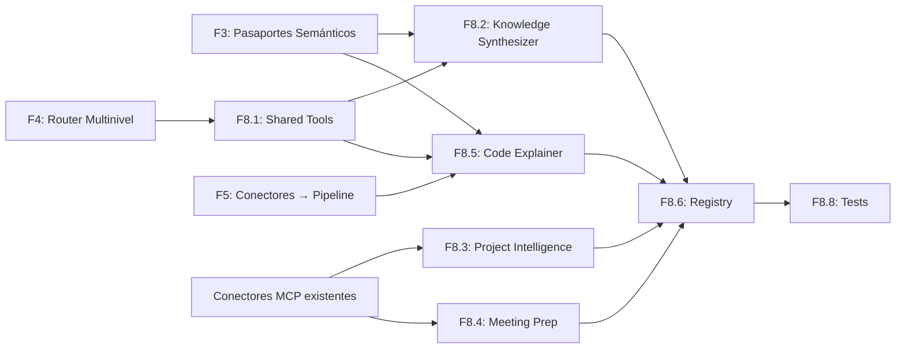

# F8 — Agentes Especializados: Synthesizer, Project Intelligence, Meeting Prep, Code Explainer
**Duración:** 3 semanas  
**Equipo:** Backend Senior (1) + IA Engineer (1)  
**Dependencias:** F3 completada (pasaportes semánticos), F4 completada (router multinivel), F5 completada (conectores → pipeline Brain)  
**Entregable:** 4 subagentes builtin operativos, integrados en el main_agent existente, invocables vía chat, optimizados para modelos Ollama (7B–14B)

---

## Objetivo

Implementar 4 agentes especializados que extienden la plataforma SecondBrainSense con capacidades de alto nivel para los usuarios finales. Cada agente sigue la definición: **LLM + herramientas + capacidad de decisión + ciclo de acción/observación**.

Los agentes reutilizan toda la infraestructura existente:
- **Subagent framework** (`SurfSenseSubagentSpec` + `pack_subagent()` + `registry.py`)
- **Router multinivel** (F4): BrainRouter L1→L2→BM25→Web
- **Pasaportes semánticos** (F3): documentos enriquecidos por `DocumentSynthesizer`
- **Conectores MCP** (Jira, Slack, Gmail, Calendar, GitHub, Confluence, Linear)
- **Web search** (SearXNG) y **BM25** (PostgreSQL tsvector)

**Antes (SurfSense sin F8):**
```
Usuario → Chat → main_agent router
                    ├── research (web_search + scrape)
                    ├── knowledge_base (filesystem)
                    ├── memory (personal notes)
                    ├── deliverables (reports, podcasts)
                    └── connectors (jira, slack, gmail...)
```

**Después (SecondBrainSense con F8):**
```
Usuario → Chat → main_agent router
                    ├── research (web_search + scrape)
                    ├── knowledge_base (filesystem)
                    ├── memory (personal notes)
                    ├── deliverables (reports, podcasts)
                    ├── connectors (jira, slack, gmail...)
                    ├── [NEW] knowledge_synthesizer (brain_search + BM25 + web + quality_trigger)
                    ├── [NEW] project_intelligence (cross-connector project reports)
                    ├── [NEW] meeting_prep (calendar + context → briefing)
                    └── [NEW] code_explainer (code collection + passports → explanation)
```

---

## Restricciones Ollama — Impacto directo en el diseño

| Modelo disponible | Context window | Calidad JSON | Uso en F8 |
|-------------------|----------------|--------------|-----------|
| qwen2.5-coder:3b | 6K tokens | Baja | NO usar — insuficiente para agentes |
| qwen2.5-coder:7b | 28K tokens | Media | Fallback mínimo, prompts cortos |
| llama3.1:8b | 30K tokens | Media | Project Intelligence, Meeting Prep |
| deepseek-r1:14b | 64K tokens | Alta | Knowledge Synthesizer, Code Explainer |
| qwen3-embedding:4b | — | — | Solo embeddings (colección code) |

**Reglas de diseño derivadas:**

1. **Prompts directivos y cortos** — máximo 400 tokens de system_prompt por agente
2. **Templates fijos para outputs** — el LLM rellena secciones, no estructura desde cero
3. **Multi-call > single-call** — varias llamadas cortas (200 tokens respuesta) mejor que una larga
4. **Pasaportes > chunks raw** — un pasaporte de 500 tokens contiene más información que 5 chunks de 300
5. **Máximo 3 rondas de búsqueda** — para no agotar el contexto en tool_calls
6. **Fallback explícito** — si modelo no disponible, degradar a prompts reducidos en qwen2.5-coder:7b

---

## F8.0 — Estado del codebase: qué existe y qué es nuevo (Día 0)

### Lo que ya existe y se REUTILIZA (NO tocar)

| Componente | Fichero | Rol en F8 |
|-----------|---------|-----------|
| `SurfSenseSubagentSpec` | `subagents/shared/spec.py` | Contrato de retorno de cada agente |
| `pack_subagent()` | `subagents/shared/subagent_builder.py` | Builder que ensambla spec + middleware + tools |
| `read_md_file()` | `subagents/shared/md_file_reader.py` | Lee description.md y system_prompt.md |
| `registry.py` | `subagents/registry.py` | Registro central — aquí se añaden los 4 nuevos |
| `create_web_search_tool` | `subagents/builtins/research/tools/web_search.py` | Reutilizar en Knowledge Synthesizer |
| `ConnectorService._combined_rrf_search()` | `app/services/connector_service.py` | Búsqueda híbrida en knowledge base |
| `ChucksHybridSearchRetriever.full_text_search()` | `app/retriever/chunks_hybrid_search.py` | BM25 PostgreSQL |
| `BrainRouter.route()` | `app/brain/router.py` (F4) | Router L1→L2 en Qdrant |
| MCP tools (jira, slack, gmail, calendar, etc.) | `subagents/connectors/*/tools/` | Herramientas via MCP |
| `deliverables/tools/report.py` | `subagents/builtins/deliverables/tools/report.py` | Patrón de generación de informes |

### Lo que F8 debe CREAR

| Componente | Ruta | Descripción |
|-----------|------|-------------|
| Knowledge Synthesizer | `subagents/builtins/knowledge_synthesizer/` | Agente 1 completo |
| Project Intelligence | `subagents/builtins/project_intelligence/` | Agente 2 completo |
| Meeting Prep | `subagents/builtins/meeting_prep/` | Agente 3 completo |
| Code Explainer | `subagents/builtins/code_explainer/` | Agente 4 completo |
| Tools compartidas | `subagents/builtins/_shared_brain_tools/` | brain_router_tool, bm25_tool |

### Lo que F8 debe MODIFICAR

| Fichero | Cambio |
|---------|--------|
| `subagents/registry.py` | Añadir 4 imports + 4 entries en `_BUILTIN_BUILDERS` |
| `constants.py` | Añadir nombres de agentes si el router los requiere |

---

## F8.1 — Infraestructura compartida: `_shared_brain_tools/` (Día 1)

**Ruta:** `surfsense_backend/app/agents/chat/multi_agent_chat/subagents/builtins/_shared_brain_tools/`

Crear herramientas LangChain que envuelven componentes de F3/F4 para reutilizarlas en múltiples agentes.

### `brain_router_tool.py` — Wrapper del BrainRouter de F4

```python
"""LangChain tool wrapper for BrainRouter (F4 multinivel search)."""

from __future__ import annotations

from typing import Any

from langchain_core.tools import tool

from app.brain.router import BrainRouter


def create_brain_search_tool(
    *,
    search_space_id: str = "",
    collection: str | None = None,
) -> Any:
    """Factory: creates a brain_search tool bound to a search_space_id."""

    @tool
    def brain_search(query: str) -> str:
        """Search the Brain knowledge base using the multinivel router (L1→L2).

        Returns the most relevant passages from semantic passports and indexed
        documents in Qdrant. Use this for deep knowledge questions.

        Args:
            query: The search question in natural language.
        """
        router = BrainRouter(search_space_id=search_space_id)

        if collection:
            # Direct collection search (for code_explainer)
            results = router._search(collection, query, top_k=5)
        else:
            # Full cascade L1→L2
            result = router.route(query, top_k=5)
            results = result.get("results", [])

        if not results:
            return "No se encontraron resultados relevantes en Brain."

        formatted = []
        for i, r in enumerate(results, 1):
            payload = r.payload if hasattr(r, "payload") else r
            text = payload.get("text", payload.get("content", str(payload)))
            source = payload.get("source", payload.get("slug", "desconocido"))
            score = getattr(r, "score", 0.0)
            formatted.append(f"[{i}] (score={score:.2f}, fuente={source})\n{text[:600]}")

        return "\n---\n".join(formatted)

    return brain_search
```

### `bm25_search_tool.py` — Wrapper de búsqueda keyword PostgreSQL

```python
"""LangChain tool wrapper for BM25 full-text search (PostgreSQL tsvector)."""

from __future__ import annotations

import asyncio
from typing import Any

from langchain_core.tools import tool


def create_bm25_search_tool(
    *,
    search_space_id: int,
    db_session: Any,
) -> Any:
    """Factory: creates a bm25_search tool for keyword search in PostgreSQL."""

    @tool
    def bm25_search(query: str) -> str:
        """Search documents using keyword matching (BM25/tsvector).

        Best for exact terms, names, identifiers, error codes.
        Complements semantic search when you need precision over similarity.

        Args:
            query: Keywords or exact terms to search for.
        """
        from app.retriever.chunks_hybrid_search import ChucksHybridSearchRetriever

        retriever = ChucksHybridSearchRetriever(db_session)

        # full_text_search is async — run in event loop
        try:
            loop = asyncio.get_event_loop()
            if loop.is_running():
                import concurrent.futures
                with concurrent.futures.ThreadPoolExecutor() as pool:
                    chunks = pool.submit(
                        asyncio.run,
                        retriever.full_text_search(
                            query_text=query,
                            top_k=5,
                            search_space_id=search_space_id,
                        ),
                    ).result()
            else:
                chunks = loop.run_until_complete(
                    retriever.full_text_search(
                        query_text=query,
                        top_k=5,
                        search_space_id=search_space_id,
                    )
                )
        except Exception as e:
            return f"Error en búsqueda BM25: {e}"

        if not chunks:
            return "No se encontraron resultados keyword."

        formatted = []
        for i, c in enumerate(chunks, 1):
            content = c.content if hasattr(c, "content") else str(c)
            source = getattr(getattr(c, "document", None), "title", "desconocido")
            formatted.append(f"[{i}] (fuente={source})\n{content[:500]}")

        return "\n---\n".join(formatted)

    return bm25_search
```

### `__init__.py`

```python
"""Shared Brain tools reusable across multiple builtin agents."""

from ._shared_brain_tools.brain_router_tool import create_brain_search_tool
from ._shared_brain_tools.bm25_search_tool import create_bm25_search_tool

__all__ = ["create_brain_search_tool", "create_bm25_search_tool"]
```

---

## F8.2 — Agente 1: Knowledge Synthesizer (Días 2-5)

**Ruta:** `surfsense_backend/app/agents/chat/multi_agent_chat/subagents/builtins/knowledge_synthesizer/`

### Propósito

Sintetizar conocimiento de múltiples fuentes (Qdrant brain/knowledge + BM25 + web) produciendo respuestas estructuradas con citaciones verificables. Implementa el `quality_trigger` del pipeline Second Brain: si la síntesis no cubre la pregunta, busca más o escala a web.

### Ciclo Acción/Observación

```
1. PLANIFICAR    → Descomponer pregunta en max 3 sub-preguntas
2. BUSCAR        → brain_search + bm25_search por sub-pregunta
3. EVALUAR       → evaluate_coverage: ¿resultados cubren la pregunta?
   → PARCIAL/NO  → ampliar con sinónimos, reformular, o web_search (max 3 iteraciones)
   → SÍ          → continuar
4. SINTETIZAR    → synthesize_with_citations: respuesta citada por sub-pregunta
5. RESPONDER     → Fusionar sub-respuestas en respuesta final
```

### Estructura de ficheros

```
knowledge_synthesizer/
├── __init__.py
├── agent.py
├── description.md
├── system_prompt.md
└── tools/
    ├── __init__.py
    ├── index.py
    ├── evaluate_coverage.py
    └── synthesize_with_citations.py
```

### `description.md`

```markdown
Specialist for deep knowledge synthesis across multiple sources.
Use when the user asks complex questions requiring information from several documents,
needs a comprehensive answer with citations, or when a simple search is insufficient.
Handles: "what do we know about X", "summarize everything related to Y",
"compare approaches to Z", "explain the relationship between A and B".
Do NOT use for: simple factual lookups (use knowledge_base), project status (use project_intelligence),
meeting preparation (use meeting_prep), code explanation (use code_explainer).
```

### `system_prompt.md`

```markdown
You are a knowledge synthesizer. Your job is to produce comprehensive, cited answers from multiple sources.

WORKFLOW:
1. Break the user's question into max 3 sub-questions
2. For each sub-question, search using brain_search (semantic passports) and bm25_search (exact keywords)
3. Use evaluate_coverage to check if results answer the question
4. If coverage is PARTIAL or NO: try synonyms, rephrase, or use web_search (max 3 total search rounds)
5. Use synthesize_with_citations to produce the final answer

RULES:
- ALWAYS cite sources as [FUENTE: document_name]
- Max 3 search rounds total — do not loop indefinitely
- Prioritize Brain passports (they contain pre-analyzed semantic information)
- If insufficient information after 3 rounds, say so explicitly
- Use Spanish for the final answer unless the user writes in another language
- Keep each synthesized section under 300 words

OUTPUT FORMAT:
## Síntesis: {topic}
### {sub-question 1}
{answer with citations}
### {sub-question 2}
{answer with citations}
### Fuentes consultadas
- {list of sources}
```

### `agent.py`

```python
"""``knowledge_synthesizer`` route: SurfSenseSubagentSpec builder."""

from __future__ import annotations

from typing import Any

from langchain_core.language_models import BaseChatModel
from langchain_core.tools import BaseTool

from app.agents.chat.multi_agent_chat.subagents.shared.md_file_reader import (
    read_md_file,
)
from app.agents.chat.multi_agent_chat.subagents.shared.spec import SurfSenseSubagentSpec
from app.agents.chat.multi_agent_chat.subagents.shared.subagent_builder import (
    pack_subagent,
)

from .tools.index import NAME, RULESET, load_tools


def build_subagent(
    *,
    dependencies: dict[str, Any],
    model: BaseChatModel | None = None,
    middleware_stack: dict[str, Any] | None = None,
    mcp_tools: list[BaseTool] | None = None,
) -> SurfSenseSubagentSpec:
    tools = [*load_tools(dependencies=dependencies), *(mcp_tools or [])]
    description = (
        read_md_file(__package__, "description").strip()
        or "Handles knowledge synthesis tasks with citations."
    )
    system_prompt = read_md_file(__package__, "system_prompt").strip()
    return pack_subagent(
        name=NAME,
        description=description,
        system_prompt=system_prompt,
        tools=tools,
        ruleset=RULESET,
        dependencies=dependencies,
        model=model,
        middleware_stack=middleware_stack,
    )
```

### `tools/index.py`

```python
"""``knowledge_synthesizer`` native tools and permission ruleset."""

from __future__ import annotations

from typing import Any

from langchain_core.tools import BaseTool

from app.agents.chat.multi_agent_chat.shared.permissions import Ruleset
from app.agents.chat.multi_agent_chat.subagents.builtins._shared_brain_tools.brain_router_tool import (
    create_brain_search_tool,
)
from app.agents.chat.multi_agent_chat.subagents.builtins._shared_brain_tools.bm25_search_tool import (
    create_bm25_search_tool,
)
from app.agents.chat.multi_agent_chat.subagents.builtins.research.tools.web_search import (
    create_web_search_tool,
)

from .evaluate_coverage import create_evaluate_coverage_tool
from .synthesize_with_citations import create_synthesize_with_citations_tool

NAME = "knowledge_synthesizer"

RULESET = Ruleset(origin=NAME, rules=[])


def load_tools(
    *, dependencies: dict[str, Any] | None = None, **kwargs: Any
) -> list[BaseTool]:
    d = {**(dependencies or {}), **kwargs}
    return [
        create_brain_search_tool(
            search_space_id=str(d.get("search_space_id", "")),
        ),
        create_bm25_search_tool(
            search_space_id=d.get("search_space_id"),
            db_session=d.get("db_session"),
        ),
        create_web_search_tool(
            search_space_id=d.get("search_space_id"),
            available_connectors=d.get("available_connectors"),
        ),
        create_evaluate_coverage_tool(
            llm=d.get("llm"),
        ),
        create_synthesize_with_citations_tool(),
    ]
```

### `tools/evaluate_coverage.py`

```python
"""Tool: evaluate whether retrieved chunks cover the user's question."""

from __future__ import annotations

from typing import Any

from langchain_core.language_models import BaseChatModel
from langchain_core.messages import HumanMessage, SystemMessage
from langchain_core.tools import tool


_EVAL_SYSTEM = """Eres un evaluador de cobertura. Dado un fragmento y una pregunta,
responde EXACTAMENTE una palabra: SI, NO, o PARCIAL.
- SI: el fragmento contiene la respuesta completa
- PARCIAL: contiene información relevante pero incompleta
- NO: no responde la pregunta
Solo responde UNA palabra."""

_EVAL_USER = """Pregunta: {question}

Fragmento recuperado:
{fragment}

¿El fragmento responde la pregunta? (SI/NO/PARCIAL)"""


def create_evaluate_coverage_tool(*, llm: BaseChatModel | None = None) -> Any:
    """Factory: creates an evaluate_coverage tool using the provided LLM."""

    @tool
    def evaluate_coverage(question: str, fragment: str) -> str:
        """Evaluate if a retrieved fragment covers the user's question.

        Returns: SI (fully covers), PARCIAL (partially covers), or NO (does not cover).
        Use this after searching to decide if more searches are needed.

        Args:
            question: The original user question.
            fragment: The text fragment to evaluate.
        """
        if llm is None:
            # Fallback: heuristic based on keyword overlap
            q_words = set(question.lower().split())
            f_words = set(fragment.lower().split())
            overlap = len(q_words & f_words) / max(len(q_words), 1)
            if overlap > 0.5:
                return "SI"
            elif overlap > 0.2:
                return "PARCIAL"
            return "NO"

        messages = [
            SystemMessage(content=_EVAL_SYSTEM),
            HumanMessage(content=_EVAL_USER.format(
                question=question,
                fragment=fragment[:800],  # Limit to save context
            )),
        ]
        try:
            response = llm.invoke(messages)
            answer = response.content.strip().upper()
            # Normalize — only allow SI/NO/PARCIAL
            if "SI" in answer or "YES" in answer:
                return "SI"
            elif "PARCIAL" in answer or "PARTIAL" in answer:
                return "PARCIAL"
            return "NO"
        except Exception:
            return "PARCIAL"  # Safe default — trigger one more search

    return evaluate_coverage
```

### `tools/synthesize_with_citations.py`

```python
"""Tool: synthesize a cited answer from retrieved fragments."""

from __future__ import annotations

from typing import Any

from langchain_core.tools import tool


def create_synthesize_with_citations_tool() -> Any:
    """Factory: creates a synthesize_with_citations formatting tool."""

    @tool
    def synthesize_with_citations(question: str, fragments: str) -> str:
        """Format retrieved fragments into a cited synthesis section.

        This is a formatting helper. It structures fragments with proper citations.
        The agent should call this after gathering sufficient fragments.

        Args:
            question: The sub-question being answered.
            fragments: All relevant fragments concatenated, each prefixed with [N] (fuente=X).
        """
        # This tool assists the agent in maintaining citation format.
        # The actual synthesis is done by the LLM via the system prompt.
        # This tool reminds the agent of the expected output format.
        return (
            f"Sintetiza la respuesta a: '{question}'\n"
            f"Usando estos fragmentos:\n{fragments}\n\n"
            f"FORMATO REQUERIDO:\n"
            f"- Respuesta en prosa con citaciones inline [FUENTE: nombre_documento]\n"
            f"- Máximo 300 palabras\n"
            f"- Si hay contradicciones entre fuentes, señálalas\n"
            f"- Si la información es insuficiente, indícalo"
        )

    return synthesize_with_citations
```

---

## F8.3 — Agente 2: Project Intelligence (Días 5-8)

**Ruta:** `surfsense_backend/app/agents/chat/multi_agent_chat/subagents/builtins/project_intelligence/`

### Propósito

Agregar el estado de un proyecto consultando múltiples conectores y generando un informe consolidado con métricas, riesgos y próximos pasos. Se adapta dinámicamente a los conectores que el usuario tiene activos.

### Ciclo Acción/Observación

```
1. IDENTIFICAR    → Determinar proyecto, rango temporal, conectores disponibles
2. CONSULTAR      → Fan-out a conectores activos (max 4 consultas)
3. CORRELACIONAR  → Cruzar datos: ticket ↔ PR ↔ mensaje ↔ doc
4. DETECTAR       → Riesgos: tickets bloqueados >3d, PRs sin merge, silencios
5. REPORTAR       → Generar informe con template fijo
```

### Estructura de ficheros

```
project_intelligence/
├── __init__.py
├── agent.py
├── description.md
├── system_prompt.md
└── tools/
    ├── __init__.py
    ├── index.py
    ├── search_project_data.py
    └── generate_project_report.py
```

### `description.md`

```markdown
Specialist for aggregating project status across multiple connected tools.
Use when the user asks about the state of a project, wants a project summary,
needs to know what happened last week, or asks about blockers/risks.
Queries Jira, Linear, Slack, GitHub, Confluence based on what is connected.
Handles: "status of project X", "what happened this week on Y", "blockers on Z",
"give me a summary of project W activity".
Do NOT use for: knowledge questions (use knowledge_synthesizer), meeting prep (use meeting_prep),
code explanation (use code_explainer), creating reports/deliverables (use deliverables).
```

### `system_prompt.md`

```markdown
You are a project intelligence analyst. Your job is to aggregate project status from connected tools.

WORKFLOW:
1. Identify the project name and time range (default: last 7 days)
2. Check available_connectors to know which tools you can query
3. For each available connector relevant to the project, search for recent activity
4. Use generate_project_report to create the final structured report

RULES:
- ONLY query connectors that are available (check the context hint)
- Default time range: last 7 days unless user specifies otherwise
- If a connector is not available, mention it in the report as "not connected"
- Do NOT invent data — if no activity found, say "sin actividad reciente"
- Max 4 connector queries per report (prioritize: tickets > code > comms > docs)
- Use Spanish for the report unless user writes in another language

CONNECTOR PRIORITY (query in this order):
1. Jira OR Linear (tickets — never both unless explicitly asked)
2. GitHub (PRs, commits)
3. Slack (key messages about the project)
4. Confluence (related docs — only if time permits)

OUTPUT FORMAT:
## Estado del Proyecto: {nombre} ({fecha_inicio} — {fecha_fin})
### Tickets ({total} abiertos / {cerrados} cerrados / {bloqueados} bloqueados)
{resumen de tickets clave}
### Actividad de Código ({PRs abiertas} / {mergeadas} esta semana)
{PRs destacadas}
### Comunicación
{mensajes clave de Slack}
### Riesgos Detectados
- {riesgo 1}
- {riesgo 2}
### Próximos Pasos
- {acción 1}
- {acción 2}
### Conectores no disponibles
{lista de conectores que no están activos}
```

### `agent.py`

```python
"""``project_intelligence`` route: SurfSenseSubagentSpec builder."""

from __future__ import annotations

from typing import Any

from langchain_core.language_models import BaseChatModel
from langchain_core.tools import BaseTool

from app.agents.chat.multi_agent_chat.subagents.shared.md_file_reader import (
    read_md_file,
)
from app.agents.chat.multi_agent_chat.subagents.shared.spec import SurfSenseSubagentSpec
from app.agents.chat.multi_agent_chat.subagents.shared.subagent_builder import (
    pack_subagent,
)

from .tools.index import NAME, RULESET, load_tools


def build_subagent(
    *,
    dependencies: dict[str, Any],
    model: BaseChatModel | None = None,
    middleware_stack: dict[str, Any] | None = None,
    mcp_tools: list[BaseTool] | None = None,
) -> SurfSenseSubagentSpec:
    # Pass MCP tools — this agent uses connector tools via MCP
    tools = [*load_tools(dependencies=dependencies), *(mcp_tools or [])]
    description = (
        read_md_file(__package__, "description").strip()
        or "Handles project status aggregation across connected tools."
    )
    system_prompt = read_md_file(__package__, "system_prompt").strip()
    return pack_subagent(
        name=NAME,
        description=description,
        system_prompt=system_prompt,
        tools=tools,
        ruleset=RULESET,
        dependencies=dependencies,
        model=model,
        middleware_stack=middleware_stack,
    )
```

### `tools/index.py`

```python
"""``project_intelligence`` native tools and permission ruleset."""

from __future__ import annotations

from typing import Any

from langchain_core.tools import BaseTool

from app.agents.chat.multi_agent_chat.shared.permissions import Ruleset

from .search_project_data import create_search_project_data_tool
from .generate_project_report import create_generate_project_report_tool

NAME = "project_intelligence"

RULESET = Ruleset(origin=NAME, rules=[])


def load_tools(
    *, dependencies: dict[str, Any] | None = None, **kwargs: Any
) -> list[BaseTool]:
    d = {**(dependencies or {}), **kwargs}
    return [
        create_search_project_data_tool(
            search_space_id=d.get("search_space_id"),
            connector_service=d.get("connector_service"),
            available_connectors=d.get("available_connectors"),
        ),
        create_generate_project_report_tool(),
    ]
```

### `tools/search_project_data.py`

```python
"""Tool: search project-related data across available connectors."""

from __future__ import annotations

import asyncio
import logging
from typing import Any

from langchain_core.tools import tool

logger = logging.getLogger(__name__)


def create_search_project_data_tool(
    *,
    search_space_id: int | None = None,
    connector_service: Any | None = None,
    available_connectors: list[str] | None = None,
) -> Any:
    """Factory: creates a search_project_data tool that queries connected services."""

    @tool
    def search_project_data(project_name: str, connector: str, time_range_days: int = 7) -> str:
        """Search for project activity in a specific connector.

        Call this once per connector you want to query. Check available connectors first.

        Args:
            project_name: The project name or identifier to search for.
            connector: Which connector to search (jira, linear, slack, github, confluence).
            time_range_days: How many days back to search (default 7).
        """
        if available_connectors and connector not in available_connectors:
            return f"Conector '{connector}' no está disponible. Conectores activos: {available_connectors}"

        if connector_service is None:
            return "Error: connector_service no disponible."

        try:
            # Use the existing connector search infrastructure
            loop = asyncio.get_event_loop()
            if loop.is_running():
                import concurrent.futures
                with concurrent.futures.ThreadPoolExecutor() as pool:
                    results = pool.submit(
                        asyncio.run,
                        connector_service.search_crawled_urls(
                            search_space_id=search_space_id,
                            query=project_name,
                            top_k=10,
                            connector_type=connector,
                        ),
                    ).result()
            else:
                results = loop.run_until_complete(
                    connector_service.search_crawled_urls(
                        search_space_id=search_space_id,
                        query=project_name,
                        top_k=10,
                        connector_type=connector,
                    )
                )
        except Exception as e:
            logger.warning(f"Error searching {connector} for project {project_name}: {e}")
            return f"Error consultando {connector}: {str(e)[:200]}"

        if not results:
            return f"Sin resultados en {connector} para '{project_name}' (últimos {time_range_days} días)."

        formatted = []
        for i, r in enumerate(results[:8], 1):  # Max 8 results per connector
            title = getattr(r, "title", "sin título")
            content = getattr(r, "content", str(r))[:300]
            formatted.append(f"[{i}] {title}\n{content}")

        return f"## Resultados de {connector} ({len(results)} encontrados):\n" + "\n---\n".join(formatted)

    return search_project_data
```

### `tools/generate_project_report.py`

```python
"""Tool: generate a structured project status report from gathered data."""

from __future__ import annotations

from typing import Any

from langchain_core.tools import tool


def create_generate_project_report_tool() -> Any:
    """Factory: creates a generate_project_report formatting tool."""

    @tool
    def generate_project_report(
        project_name: str,
        tickets_summary: str = "Sin datos",
        code_summary: str = "Sin datos",
        comms_summary: str = "Sin datos",
        risks: str = "Ninguno detectado",
        unavailable_connectors: str = "",
    ) -> str:
        """Generate the final structured project report from gathered data.

        Call this AFTER querying all relevant connectors. Pass the summaries
        from each connector query.

        Args:
            project_name: The project name.
            tickets_summary: Summary of ticket activity (from Jira/Linear).
            code_summary: Summary of code activity (from GitHub).
            comms_summary: Summary of communications (from Slack).
            risks: Detected risks based on the data.
            unavailable_connectors: Connectors that were not available.
        """
        from datetime import datetime, timedelta

        end_date = datetime.now().strftime("%Y-%m-%d")
        start_date = (datetime.now() - timedelta(days=7)).strftime("%Y-%m-%d")

        report = f"""## Estado del Proyecto: {project_name} ({start_date} — {end_date})

### Tickets
{tickets_summary}

### Actividad de Código
{code_summary}

### Comunicación
{comms_summary}

### Riesgos Detectados
{risks}

### Próximos Pasos
(El agente debe completar basándose en los datos anteriores)
"""
        if unavailable_connectors:
            report += f"\n### Conectores No Disponibles\n{unavailable_connectors}\n"

        return report

    return generate_project_report
```

---

## F8.4 — Agente 3: Meeting Prep (Días 8-10)

**Ruta:** `surfsense_backend/app/agents/chat/multi_agent_chat/subagents/builtins/meeting_prep/`

### Propósito

Preparar al usuario para una reunión buscando contexto relevante: datos del calendario, emails previos con los participantes, documentos relacionados y tickets asociados. Produce un briefing estructurado.

### Ciclo Acción/Observación

```
1. IDENTIFICAR    → Obtener próxima reunión (o la indicada) del calendario
2. CONTEXTUALIZAR → Extraer participantes + tema del evento
3. BUSCAR         → Emails (14 días), docs KB, tickets con participantes/tema
4. DETECTAR       → Decisiones pendientes, action items previos
5. GENERAR        → Briefing con template fijo
```

### Estructura de ficheros

```
meeting_prep/
├── __init__.py
├── agent.py
├── description.md
├── system_prompt.md
└── tools/
    ├── __init__.py
    ├── index.py
    └── generate_briefing.py
```

### `description.md`

```markdown
Specialist for preparing meeting briefings with relevant context.
Use when the user wants to prepare for a meeting, needs context about participants,
wants to know what was discussed previously, or asks for a meeting agenda.
Queries calendar, email, knowledge base, and optionally tickets.
Handles: "prepare me for my next meeting", "briefing for the meeting with X",
"what should I know before the 3pm call", "agenda for tomorrow's standup".
Do NOT use for: scheduling/creating events (use calendar connector), project status (use project_intelligence),
general knowledge questions (use knowledge_synthesizer).
```

### `system_prompt.md`

```markdown
You are a meeting preparation assistant. Your job is to create comprehensive briefings.

WORKFLOW:
1. Use calendar MCP tools (search_calendar_events) to find the target meeting
2. Extract: title, date/time, participants, description
3. Search emails (gmail MCP tools) for recent threads with participants about the topic (last 14 days)
4. Search knowledge_base for related documents
5. Optionally search Jira/Linear if a project is mentioned
6. Generate the briefing with generate_briefing

RULES:
- If no specific meeting mentioned, use the NEXT upcoming meeting
- Maximum 5 sources cited in the briefing
- If calendar is not connected, tell the user you need it
- Do NOT invent participants or topics — only use real data
- Time range for email search: 14 days back
- Use Spanish unless user writes in another language
- Keep briefing concise — max 500 words total

OUTPUT FORMAT (via generate_briefing tool):
## Briefing: {título de la reunión}
**Fecha:** {fecha y hora} | **Participantes:** {lista}

### Contexto
{resumen de emails/docs relevantes — max 3 fuentes con citación}

### Puntos Pendientes
{action items de reuniones anteriores, tickets abiertos}

### Agenda Sugerida
1. {punto 1}
2. {punto 2}
3. {punto 3}

### Preguntas a Preparar
- {pregunta basada en el contexto encontrado}
- {pregunta basada en el contexto encontrado}
```

### `agent.py`

```python
"""``meeting_prep`` route: SurfSenseSubagentSpec builder."""

from __future__ import annotations

from typing import Any

from langchain_core.language_models import BaseChatModel
from langchain_core.tools import BaseTool

from app.agents.chat.multi_agent_chat.subagents.shared.md_file_reader import (
    read_md_file,
)
from app.agents.chat.multi_agent_chat.subagents.shared.spec import SurfSenseSubagentSpec
from app.agents.chat.multi_agent_chat.subagents.shared.subagent_builder import (
    pack_subagent,
)

from .tools.index import NAME, RULESET, load_tools


def build_subagent(
    *,
    dependencies: dict[str, Any],
    model: BaseChatModel | None = None,
    middleware_stack: dict[str, Any] | None = None,
    mcp_tools: list[BaseTool] | None = None,
) -> SurfSenseSubagentSpec:
    # MCP tools are critical here — calendar, gmail, jira come via MCP
    tools = [*load_tools(dependencies=dependencies), *(mcp_tools or [])]
    description = (
        read_md_file(__package__, "description").strip()
        or "Handles meeting preparation and briefing generation."
    )
    system_prompt = read_md_file(__package__, "system_prompt").strip()
    return pack_subagent(
        name=NAME,
        description=description,
        system_prompt=system_prompt,
        tools=tools,
        ruleset=RULESET,
        dependencies=dependencies,
        model=model,
        middleware_stack=middleware_stack,
    )
```

### `tools/index.py`

```python
"""``meeting_prep`` native tools and permission ruleset."""

from __future__ import annotations

from typing import Any

from langchain_core.tools import BaseTool

from app.agents.chat.multi_agent_chat.shared.permissions import Ruleset
from app.agents.chat.multi_agent_chat.subagents.builtins._shared_brain_tools.brain_router_tool import (
    create_brain_search_tool,
)

from .generate_briefing import create_generate_briefing_tool

NAME = "meeting_prep"

RULESET = Ruleset(origin=NAME, rules=[])


def load_tools(
    *, dependencies: dict[str, Any] | None = None, **kwargs: Any
) -> list[BaseTool]:
    d = {**(dependencies or {}), **kwargs}
    return [
        create_brain_search_tool(
            search_space_id=str(d.get("search_space_id", "")),
        ),
        create_generate_briefing_tool(),
        # Calendar, Gmail, Jira tools come via mcp_tools parameter in build_subagent
    ]
```

### `tools/generate_briefing.py`

```python
"""Tool: generate a structured meeting briefing."""

from __future__ import annotations

from typing import Any

from langchain_core.tools import tool


def create_generate_briefing_tool() -> Any:
    """Factory: creates a generate_briefing formatting tool."""

    @tool
    def generate_briefing(
        meeting_title: str,
        date_time: str,
        participants: str,
        context_summary: str = "Sin contexto previo encontrado.",
        pending_items: str = "Sin puntos pendientes detectados.",
        suggested_agenda: str = "",
        questions: str = "",
    ) -> str:
        """Generate a structured meeting briefing document.

        Call this AFTER gathering context from calendar, emails, and knowledge base.

        Args:
            meeting_title: Title of the meeting.
            date_time: Date and time of the meeting.
            participants: Comma-separated list of participants.
            context_summary: Summary of relevant context found (emails, docs).
            pending_items: Action items or open issues from previous interactions.
            suggested_agenda: Suggested agenda points (numbered).
            questions: Questions to prepare based on context.
        """
        briefing = f"""## Briefing: {meeting_title}
**Fecha:** {date_time} | **Participantes:** {participants}

### Contexto
{context_summary}

### Puntos Pendientes
{pending_items}
"""
        if suggested_agenda:
            briefing += f"\n### Agenda Sugerida\n{suggested_agenda}\n"

        if questions:
            briefing += f"\n### Preguntas a Preparar\n{questions}\n"

        return briefing

    return generate_briefing
```

---

## F8.5 — Agente 4: Code Explainer (Días 10-14)

**Ruta:** `surfsense_backend/app/agents/chat/multi_agent_chat/subagents/builtins/code_explainer/`

### Propósito

Explicar código indexado desde GitHub o subido como fichero. Busca en la colección `code` de Qdrant (embeddings de 2560d vía qwen3-embedding:4b) y en pasaportes semánticos de tipo código para dar explicaciones contextualizadas a 4 niveles.

### Ciclo Acción/Observación

```
1. LOCALIZAR      → Buscar código por nombre/función/descripción (code Qdrant + BM25)
2. CONTEXTUALIZAR → Obtener pasaporte semántico del fichero (propósito, deps, exports)
3. ANALIZAR       → Identificar patrón, flujo principal, dependencias
4. EXPLICAR       → 4 niveles: TL;DR → Contexto → Flujo → Dependencias
5. RELACIONAR     → Señalar ficheros/funciones conectados en el repo
```

### Estructura de ficheros

```
code_explainer/
├── __init__.py
├── agent.py
├── description.md
├── system_prompt.md
└── tools/
    ├── __init__.py
    ├── index.py
    ├── search_code_passport.py
    └── explain_code.py
```

### `description.md`

```markdown
Specialist for explaining code from indexed repositories and uploaded files.
Use when the user asks to explain, understand, or navigate code that has been
indexed in the platform (from GitHub connector or file uploads).
Handles: "explain this file", "what does function X do", "how does module Y work",
"what are the dependencies of Z", "walk me through the code in router.py".
Do NOT use for: writing new code (use knowledge_base), project status (use project_intelligence),
general knowledge (use knowledge_synthesizer), web searches about code (use research).
```

### `system_prompt.md`

```markdown
You are a code explanation expert. Your job is to explain indexed code clearly at multiple levels.

WORKFLOW:
1. Use brain_search with collection="code" to find the relevant code
2. Use search_code_passport to get the semantic passport (contains pre-analyzed: purpose, deps, exports, patterns)
3. If you need more context, use bm25_search with the function/class name
4. Use explain_code to structure your explanation in 4 levels

RULES:
- ALWAYS check the passport first — it already has semantic analysis you should NOT redo
- Use the passport's "dependencies" and "exports" sections directly
- Do NOT dump the entire file — cite only relevant lines/sections
- If the code is not found in the index, say so
- Use qwen2.5-coder strengths: be precise about types, patterns, and control flow
- Explain in Spanish unless user writes in another language
- For large files (>200 lines), focus on the specific function/class asked about

OUTPUT FORMAT (4 levels):
### TL;DR
{1 línea: qué hace este código}

### Contexto
{Rol en el proyecto, de dónde viene, qué problema resuelve}

### Flujo
{Lógica paso a paso del flujo principal}
1. {paso 1}
2. {paso 2}
...

### Dependencias
**Usa:** {lista de imports/dependencias clave}
**Lo usan:** {quién importa/llama este código}
```

### `agent.py`

```python
"""``code_explainer`` route: SurfSenseSubagentSpec builder."""

from __future__ import annotations

from typing import Any

from langchain_core.language_models import BaseChatModel
from langchain_core.tools import BaseTool

from app.agents.chat.multi_agent_chat.subagents.shared.md_file_reader import (
    read_md_file,
)
from app.agents.chat.multi_agent_chat.subagents.shared.spec import SurfSenseSubagentSpec
from app.agents.chat.multi_agent_chat.subagents.shared.subagent_builder import (
    pack_subagent,
)

from .tools.index import NAME, RULESET, load_tools


def build_subagent(
    *,
    dependencies: dict[str, Any],
    model: BaseChatModel | None = None,
    middleware_stack: dict[str, Any] | None = None,
    mcp_tools: list[BaseTool] | None = None,
) -> SurfSenseSubagentSpec:
    tools = [*load_tools(dependencies=dependencies), *(mcp_tools or [])]
    description = (
        read_md_file(__package__, "description").strip()
        or "Handles code explanation from indexed repositories."
    )
    system_prompt = read_md_file(__package__, "system_prompt").strip()
    return pack_subagent(
        name=NAME,
        description=description,
        system_prompt=system_prompt,
        tools=tools,
        ruleset=RULESET,
        dependencies=dependencies,
        model=model,
        middleware_stack=middleware_stack,
    )
```

### `tools/index.py`

```python
"""``code_explainer`` native tools and permission ruleset."""

from __future__ import annotations

from typing import Any

from langchain_core.tools import BaseTool

from app.agents.chat.multi_agent_chat.shared.permissions import Ruleset
from app.agents.chat.multi_agent_chat.subagents.builtins._shared_brain_tools.brain_router_tool import (
    create_brain_search_tool,
)
from app.agents.chat.multi_agent_chat.subagents.builtins._shared_brain_tools.bm25_search_tool import (
    create_bm25_search_tool,
)

from .search_code_passport import create_search_code_passport_tool
from .explain_code import create_explain_code_tool

NAME = "code_explainer"

RULESET = Ruleset(origin=NAME, rules=[])


def load_tools(
    *, dependencies: dict[str, Any] | None = None, **kwargs: Any
) -> list[BaseTool]:
    d = {**(dependencies or {}), **kwargs}
    return [
        create_brain_search_tool(
            search_space_id=str(d.get("search_space_id", "")),
            collection="code",  # Direct search in code collection (2560d embeddings)
        ),
        create_search_code_passport_tool(
            search_space_id=str(d.get("search_space_id", "")),
        ),
        create_bm25_search_tool(
            search_space_id=d.get("search_space_id"),
            db_session=d.get("db_session"),
        ),
        create_explain_code_tool(),
    ]
```

### `tools/search_code_passport.py`

```python
"""Tool: search semantic passports for code files in the brain collection."""

from __future__ import annotations

from typing import Any

from langchain_core.tools import tool

from app.brain.router import BrainRouter


def create_search_code_passport_tool(
    *,
    search_space_id: str = "",
) -> Any:
    """Factory: creates a search_code_passport tool for code-type passports."""

    @tool
    def search_code_passport(filename_or_description: str) -> str:
        """Search for the semantic passport of a code file.

        Passports contain pre-analyzed information: purpose, dependencies, exports,
        patterns, and key functions. Use this BEFORE trying to explain code —
        the passport already has the analysis done.

        Args:
            filename_or_description: The filename (e.g. "router.py") or description
                of the code you want the passport for.
        """
        router = BrainRouter(search_space_id=search_space_id)

        # Search in brain collection (passports) with code-related query
        query = f"code file: {filename_or_description}"
        results = router._search("brain", query, top_k=3)

        if not results:
            return f"No se encontró pasaporte semántico para '{filename_or_description}'."

        # Filter for code-type passports
        code_results = []
        for r in results:
            payload = r.payload if hasattr(r, "payload") else r
            doc_type = payload.get("type", payload.get("file_type", ""))
            # Include if it looks like code (py, js, ts, java, etc.) or score is high
            if doc_type in ("py", "js", "ts", "java", "go", "rs", "code") or getattr(r, "score", 0) > 0.6:
                code_results.append(r)

        if not code_results:
            # Return best match anyway
            code_results = results[:1]

        formatted = []
        for r in code_results[:2]:  # Max 2 passports
            payload = r.payload if hasattr(r, "payload") else r
            text = payload.get("text", payload.get("content", str(payload)))
            source = payload.get("source", payload.get("slug", "desconocido"))
            score = getattr(r, "score", 0.0)
            formatted.append(
                f"### Pasaporte: {source} (score={score:.2f})\n{text[:1200]}"
            )

        return "\n\n".join(formatted)

    return search_code_passport
```

### `tools/explain_code.py`

```python
"""Tool: structure a code explanation in 4 levels."""

from __future__ import annotations

from typing import Any

from langchain_core.tools import tool


def create_explain_code_tool() -> Any:
    """Factory: creates an explain_code formatting/guidance tool."""

    @tool
    def explain_code(
        filename: str,
        tldr: str,
        context: str,
        flow: str,
        dependencies_uses: str = "",
        dependencies_used_by: str = "",
    ) -> str:
        """Structure a code explanation in 4 levels.

        Call this AFTER you have gathered code and passport information.
        This formats the explanation consistently.

        Args:
            filename: The file being explained.
            tldr: One-line summary of what the code does.
            context: Role in the project, what problem it solves.
            flow: Step-by-step logic of the main flow (numbered).
            dependencies_uses: What this code imports/depends on.
            dependencies_used_by: What other code uses/imports this.
        """
        explanation = f"""## Explicación: `{filename}`

### TL;DR
{tldr}

### Contexto
{context}

### Flujo
{flow}

### Dependencias
**Usa:** {dependencies_uses or "No determinado"}
**Lo usan:** {dependencies_used_by or "No determinado"}
"""
        return explanation

    return explain_code
```

---

## F8.6 — Registro en `registry.py` y constantes (Día 14-15)

### Cambios en `registry.py`

Añadir los 4 imports y registrar los builders:

```python
# --- AÑADIR IMPORTS (después de los imports existentes de builtins) ---

from app.agents.chat.multi_agent_chat.subagents.builtins.knowledge_synthesizer.agent import (
    build_subagent as build_knowledge_synthesizer_subagent,
)
from app.agents.chat.multi_agent_chat.subagents.builtins.project_intelligence.agent import (
    build_subagent as build_project_intelligence_subagent,
)
from app.agents.chat.multi_agent_chat.subagents.builtins.meeting_prep.agent import (
    build_subagent as build_meeting_prep_subagent,
)
from app.agents.chat.multi_agent_chat.subagents.builtins.code_explainer.agent import (
    build_subagent as build_code_explainer_subagent,
)
```

```python
# --- AÑADIR AL DICT _BUILTIN_BUILDERS (junto con los existentes) ---

_BUILTIN_BUILDERS: dict[str, BuilderCallable] = {
    # ... existentes ...
    "knowledge_synthesizer": build_knowledge_synthesizer_subagent,
    "project_intelligence": build_project_intelligence_subagent,
    "meeting_prep": build_meeting_prep_subagent,
    "code_explainer": build_code_explainer_subagent,
}
```

### Cambios en `constants.py` (si necesario)

Si el main agent usa `SUBAGENT_TO_REQUIRED_CONNECTOR_MAP` para filtrar subagentes por conectores disponibles:

```python
# Los 4 nuevos agentes no requieren un conector ESPECÍFICO obligatorio
# (se adaptan dinámicamente a lo que hay disponible)
# Pero project_intelligence y meeting_prep se benefician de:
SUBAGENT_TO_REQUIRED_CONNECTOR_MAP.update({
    # knowledge_synthesizer: no requiere conector específico — usa Brain + BM25
    # code_explainer: no requiere conector específico — usa Brain colección code
    # project_intelligence: se beneficia de estos pero no los REQUIERE:
    # "project_intelligence": ["jira"],  # NO — el agente se adapta
    # meeting_prep: se beneficia de calendar pero no REQUIERE:
    # "meeting_prep": ["calendar"],  # NO — informa al usuario si falta
})
```

> **Decisión**: Los 4 agentes se registran sin requerir conectores obligatorios. Cada uno detecta internamente qué conectores están disponibles y se adapta (o informa al usuario de lo que falta).

---

## F8.7 — Context Hints para inyectar metadata al agente (Día 15)

Cada subagente necesita saber: `search_space_id`, `available_connectors`, timezone del usuario. El framework ya soporta esto vía `ContextHintProvider`:

```python
# En cada agent.py, añadir context_hint_provider al SurfSenseSubagentSpec:

from app.agents.chat.multi_agent_chat.subagents.shared.spec import (
    ContextHintProvider,
    SurfSenseSubagentSpec,
)


def _project_intelligence_hint(state: dict, description: str) -> str | None:
    """Inject available connectors into the subagent's first message."""
    connectors = state.get("available_connectors", [])
    if connectors:
        return f"Conectores disponibles: {', '.join(connectors)}"
    return "No hay conectores activos — solo puedo usar la knowledge base."
```

Este patrón ya se usa en otros subagentes (ver `SURF_CONTEXT_HINT_PROVIDER_KEY` en `spec.py`).

---

## F8.8 — Testing y validación (Días 15-17)

### Queries de test por agente

| Agente | Query de test | Resultado esperado |
|--------|---------------|-------------------|
| Knowledge Synthesizer | "sintetiza qué sabemos sobre el pipeline de procesamiento" | Respuesta con citaciones [FUENTE: ...] de pasaportes Brain |
| Knowledge Synthesizer | "compara las aproximaciones a indexación vectorial" | Multi-source con BM25 + Brain |
| Project Intelligence | "estado del proyecto SecondBrainSense" | Informe con secciones, indica conectores no disponibles |
| Project Intelligence | "qué ha pasado esta semana en el proyecto X" | Intenta Jira + GitHub + Slack |
| Meeting Prep | "prepárame para mi próxima reunión" | Consulta calendario, briefing con template |
| Meeting Prep | "briefing para la reunión con Juan" | Busca emails con Juan + docs |
| Code Explainer | "explica el fichero router.py" | 4 niveles: TL;DR + Contexto + Flujo + Deps |
| Code Explainer | "qué hace la función build_subagent" | Localiza en code + pasaporte + explica |

### Métricas de aceptación

| Métrica | Target | Modelo |
|---------|--------|--------|
| Tiempo de respuesta | < 30s | qwen2.5-coder:7b en CPU |
| Tiempo de respuesta | < 15s | deepseek-r1:14b en GPU |
| Citaciones correctas | ≥ 80% | Las fuentes citadas existen en el índice |
| Routing correcto | ≥ 90% | El main_agent invoca el subagente correcto |
| Degradación graceful | 100% | Nunca falla con error — reporta limitaciones |

### Script de test

```python
# surfsense_backend/tests/agents/test_f8_agents.py

import pytest
from unittest.mock import AsyncMock, MagicMock

from app.agents.chat.multi_agent_chat.subagents.builtins.knowledge_synthesizer.agent import (
    build_subagent as build_ks,
)
from app.agents.chat.multi_agent_chat.subagents.builtins.project_intelligence.agent import (
    build_subagent as build_pi,
)
from app.agents.chat.multi_agent_chat.subagents.builtins.meeting_prep.agent import (
    build_subagent as build_mp,
)
from app.agents.chat.multi_agent_chat.subagents.builtins.code_explainer.agent import (
    build_subagent as build_ce,
)


@pytest.fixture
def mock_dependencies():
    return {
        "llm": MagicMock(),
        "search_space_id": 1,
        "db_session": MagicMock(),
        "connector_service": MagicMock(),
        "available_connectors": ["jira", "slack", "github"],
        "thread_id": "test-thread-123",
        "filesystem_mode": "read_only",
    }


class TestKnowledgeSynthesizerBuild:
    def test_builds_spec_with_tools(self, mock_dependencies):
        spec = build_ks(dependencies=mock_dependencies)
        assert spec.spec["name"] == "knowledge_synthesizer"
        assert len(spec.spec["tools"]) >= 4  # brain, bm25, web, evaluate, synthesize

    def test_description_not_empty(self, mock_dependencies):
        spec = build_ks(dependencies=mock_dependencies)
        assert len(spec.spec["description"]) > 20


class TestProjectIntelligenceBuild:
    def test_builds_spec_with_tools(self, mock_dependencies):
        spec = build_pi(dependencies=mock_dependencies)
        assert spec.spec["name"] == "project_intelligence"
        assert len(spec.spec["tools"]) >= 2

    def test_accepts_mcp_tools(self, mock_dependencies):
        mock_tool = MagicMock()
        mock_tool.name = "jira_search"
        spec = build_pi(dependencies=mock_dependencies, mcp_tools=[mock_tool])
        tool_names = [t.name for t in spec.spec["tools"]]
        assert "jira_search" in tool_names


class TestMeetingPrepBuild:
    def test_builds_spec(self, mock_dependencies):
        spec = build_mp(dependencies=mock_dependencies)
        assert spec.spec["name"] == "meeting_prep"

    def test_includes_brain_search(self, mock_dependencies):
        spec = build_mp(dependencies=mock_dependencies)
        tool_names = [t.name for t in spec.spec["tools"]]
        assert "brain_search" in tool_names


class TestCodeExplainerBuild:
    def test_builds_spec_with_code_tools(self, mock_dependencies):
        spec = build_ce(dependencies=mock_dependencies)
        assert spec.spec["name"] == "code_explainer"
        tool_names = [t.name for t in spec.spec["tools"]]
        assert "search_code_passport" in tool_names
        assert "explain_code" in tool_names
```

---

## F8.9 — Configuración de modelo por agente (Día 17)

### Mapeo de modelos recomendados

Crear configuración en `.env.dev` para permitir override por agente:

```bash
# F8 Agent model configuration
# Each agent can override the default model
# If not set, falls back to SURFSENSE_DEFAULT_LLM

# Knowledge Synthesizer — needs reasoning for evaluation and multi-call synthesis
BRAIN_AGENT_KS_MODEL=deepseek-r1:14b
BRAIN_AGENT_KS_FALLBACK_MODEL=qwen2.5-coder:7b

# Project Intelligence — needs text generation, moderate reasoning
BRAIN_AGENT_PI_MODEL=llama3.1:8b
BRAIN_AGENT_PI_FALLBACK_MODEL=qwen2.5-coder:7b

# Meeting Prep — needs text generation, light reasoning
BRAIN_AGENT_MP_MODEL=llama3.1:8b
BRAIN_AGENT_MP_FALLBACK_MODEL=qwen2.5-coder:7b

# Code Explainer — needs code understanding, pattern recognition
BRAIN_AGENT_CE_MODEL=qwen2.5-coder:7b
BRAIN_AGENT_CE_FALLBACK_MODEL=qwen2.5-coder:3b
```

### Lógica de selección de modelo

```python
# En cada agent.py, antes de pack_subagent():

import os
from app.services.llm_service import get_agent_llm

def _get_model_for_agent(agent_key: str, dependencies: dict) -> BaseChatModel:
    """Get the appropriate model for this agent, with fallback."""
    model_name = os.getenv(f"BRAIN_AGENT_{agent_key}_MODEL")
    if model_name:
        try:
            return get_agent_llm(model=model_name)
        except Exception:
            pass  # Fall through to fallback

    fallback = os.getenv(f"BRAIN_AGENT_{agent_key}_FALLBACK_MODEL")
    if fallback:
        try:
            return get_agent_llm(model=fallback)
        except Exception:
            pass

    # Ultimate fallback: use whatever dependencies provides
    return dependencies.get("llm")
```

---

## Resumen de entregables

| # | Carpeta/Fichero | Contenido |
|---|-----------------|-----------|
| 1 | `builtins/_shared_brain_tools/__init__.py` | Package |
| 2 | `builtins/_shared_brain_tools/brain_router_tool.py` | BrainRouter como LangChain tool |
| 3 | `builtins/_shared_brain_tools/bm25_search_tool.py` | BM25 como LangChain tool |
| 4 | `builtins/knowledge_synthesizer/__init__.py` | Package |
| 5 | `builtins/knowledge_synthesizer/agent.py` | Builder |
| 6 | `builtins/knowledge_synthesizer/description.md` | Router description |
| 7 | `builtins/knowledge_synthesizer/system_prompt.md` | System prompt |
| 8 | `builtins/knowledge_synthesizer/tools/__init__.py` | Package |
| 9 | `builtins/knowledge_synthesizer/tools/index.py` | NAME + RULESET + load_tools |
| 10 | `builtins/knowledge_synthesizer/tools/evaluate_coverage.py` | Quality trigger tool |
| 11 | `builtins/knowledge_synthesizer/tools/synthesize_with_citations.py` | Citation formatter |
| 12 | `builtins/project_intelligence/__init__.py` | Package |
| 13 | `builtins/project_intelligence/agent.py` | Builder |
| 14 | `builtins/project_intelligence/description.md` | Router description |
| 15 | `builtins/project_intelligence/system_prompt.md` | System prompt |
| 16 | `builtins/project_intelligence/tools/__init__.py` | Package |
| 17 | `builtins/project_intelligence/tools/index.py` | NAME + RULESET + load_tools |
| 18 | `builtins/project_intelligence/tools/search_project_data.py` | Cross-connector search |
| 19 | `builtins/project_intelligence/tools/generate_project_report.py` | Report template |
| 20 | `builtins/meeting_prep/__init__.py` | Package |
| 21 | `builtins/meeting_prep/agent.py` | Builder |
| 22 | `builtins/meeting_prep/description.md` | Router description |
| 23 | `builtins/meeting_prep/system_prompt.md` | System prompt |
| 24 | `builtins/meeting_prep/tools/__init__.py` | Package |
| 25 | `builtins/meeting_prep/tools/index.py` | NAME + RULESET + load_tools |
| 26 | `builtins/meeting_prep/tools/generate_briefing.py` | Briefing template |
| 27 | `builtins/code_explainer/__init__.py` | Package |
| 28 | `builtins/code_explainer/agent.py` | Builder |
| 29 | `builtins/code_explainer/description.md` | Router description |
| 30 | `builtins/code_explainer/system_prompt.md` | System prompt |
| 31 | `builtins/code_explainer/tools/__init__.py` | Package |
| 32 | `builtins/code_explainer/tools/index.py` | NAME + RULESET + load_tools |
| 33 | `builtins/code_explainer/tools/search_code_passport.py` | Passport search |
| 34 | `builtins/code_explainer/tools/explain_code.py` | Explanation formatter |
| 35 | `registry.py` (MODIFICAR) | +4 imports, +4 builder entries |
| 36 | `tests/agents/test_f8_agents.py` | Unit tests |

**Total: 35 ficheros nuevos + 1 modificación**

---

## Cronograma

| Semana | Días | Entregable |
|--------|------|------------|
| 1 (D1-D5) | 5 | F8.1 shared tools + F8.2 Knowledge Synthesizer completo |
| 2 (D6-D10) | 5 | F8.3 Project Intelligence + F8.4 Meeting Prep |
| 3 (D11-D17) | 7 | F8.5 Code Explainer + F8.6 Registry + F8.7 Hints + F8.8 Tests + F8.9 Config |

---

## Dependencias con otras fases



**Nota:** F8.3 (Project Intelligence) y F8.4 (Meeting Prep) NO dependen de F3/F4 — usan conectores MCP que ya están operativos en SurfSense. Se pueden desarrollar en paralelo con F3/F4 si se mockean las tools Brain.

---

## Riesgos y mitigaciones

| Riesgo | Impacto | Mitigación |
|--------|---------|------------|
| Modelo Ollama demasiado lento (>30s) | UX degradada | Reducir top_k a 3, limitar a 2 rondas, acortar prompts |
| Modelo no genera JSON/formato correcto | Tool calls fallan | No usar JSON structured output — parsear con regex/heurísticas |
| BrainRouter no disponible (F4 no completada) | KS y CE no funcionan | Fallback a solo BM25 + web_search (research subagente existente) |
| Conectores MCP no configurados | PI y MP sin datos | Reportar explícitamente qué falta — degradación graceful |
| Context overflow con pasaportes largos | Truncamiento | Limitar text[:600] en tools, max 5 resultados por búsqueda |
| Main agent no rutea correctamente | Agente no se invoca | Iterar `description.md` — el router elige por similitud semántica |

---

## Criterios de aceptación

- [ ] Los 4 agentes se registran en `registry.py` sin errores de import
- [ ] El main_agent rutea correctamente ≥ 90% de queries de test a cada agente
- [ ] Knowledge Synthesizer produce respuestas con citaciones verificables
- [ ] Project Intelligence detecta conectores no disponibles y lo reporta
- [ ] Meeting Prep funciona con solo Calendar conectado (mínimo viable)
- [ ] Code Explainer devuelve explicaciones de 4 niveles usando pasaportes
- [ ] Ningún agente falla con error no manejado — todos degradan gracefully
- [ ] Tiempo de respuesta < 30s con qwen2.5-coder:7b en CPU (queries simples)
- [ ] Tests unitarios pasan: `pytest tests/agents/test_f8_agents.py -v`
